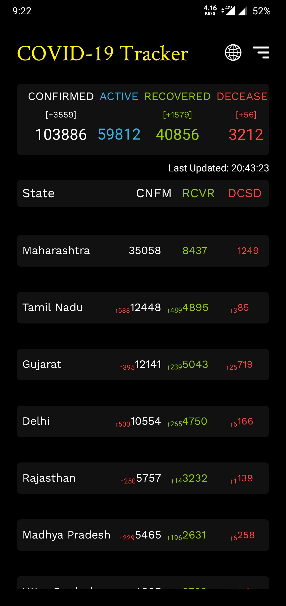
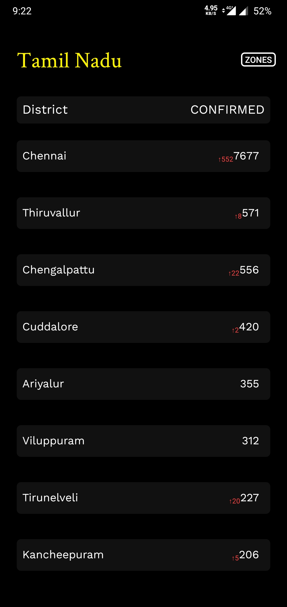
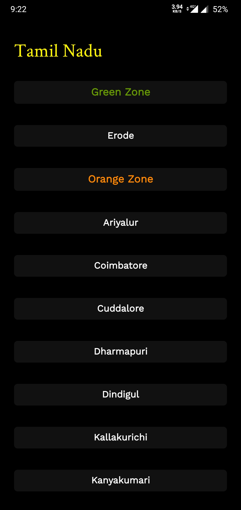
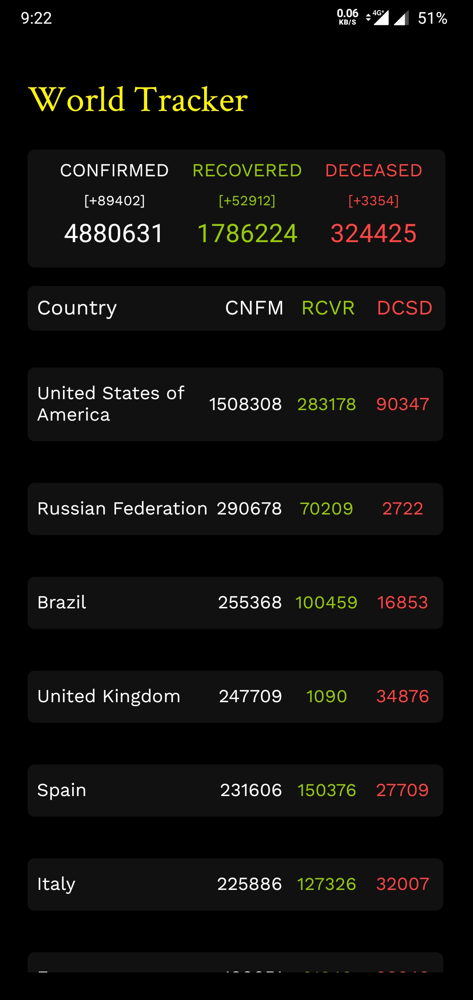
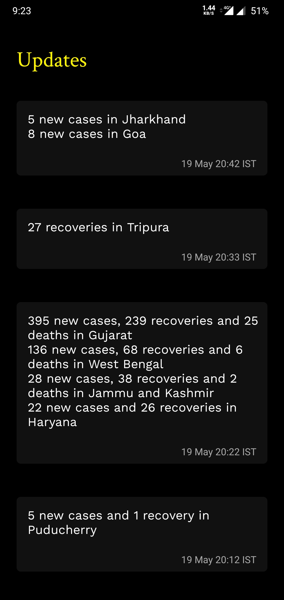

# Covid-19-Tracker-App
A Simple Android App to Track Covid-19 cases  in India. 
The [Covid19India API](https://api.covid19india.org/) was used to provide the data.
The [The News Api](https://newsapi.org/) was used to provide the Covid related News .

##  🎇Features
- [x] See Covid-19 cases in india (State-wise/District-wise) .
- [x] Read Covid-19 related news (India).
- [x] See Covid-19 cases in World .
- [x] See India Lock Down Zones.

## 📸 Screenshots

&nbsp;

&nbsp;

&nbsp;

## 🔌 APIs and Libraries 
| Name | Usage |
|:------:|:-------:|
|[**Covid19India Api**](api.covid19india.org)| Covid details for India|
|[**Covid19Api**](https://documenter.getpostman.com/view/10808728/SzS8rjbc?version=latest#intro)| World Tracker Details|
|[**News API**](https://newsapi.org/)| InApp Covid related News|
|[**Glide Library**](https://github.com/bumptech/glide/)| An image loading and caching library for Android|
|[**Volley Library**](https://developer.android.com/training/volley)| HTTP library used for networking for Android apps|
|[**TapTargetView Library**](https://github.com/KeepSafe/TapTargetView)| Meterila Design Spotlight for feature discovery|

## 🔖 License
[Apache-2.0](LICENSE)

***
> Feel free to star ⭐ this repository if you like what you see 😉.
